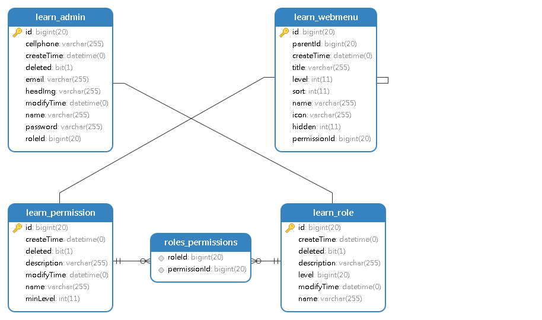

# 关于cms权限管理模块设计

##  需求分析：
*   说到cms系统，权限管理是必不可少的功能，不断完善总有些不尽人意，所以抽个时间思考一下
*   如若每个应用系统为了满足不同系统用户需求而重新设计权限，大大降低了代码的重用性，所以就有必要设计一套通用，灵活，方便的权限系统

##  ER关系模型
*   行为描述：随着系统的日益庞大，为了做到方便管理，针对每个用户授予不同权限，基本的crud操作是不可少的，每一个用户分配一个角色，角色与权限形成多对多关系，每个角色设置最大分配权限等级，
与之对应的就是每个权限所对应的权重等级，这样就可以再分配权限同时做到不会越权分配。为了避免显示业务对权限设计入侵太重，所以就引入了菜单表的设计，关联权限
一一对应与之对应的有前端路由即资源分配。权限分为显性权限（即与菜单对应），而隐性权限可以理解为接口的读写权限不用分配菜单

*   授权示例

