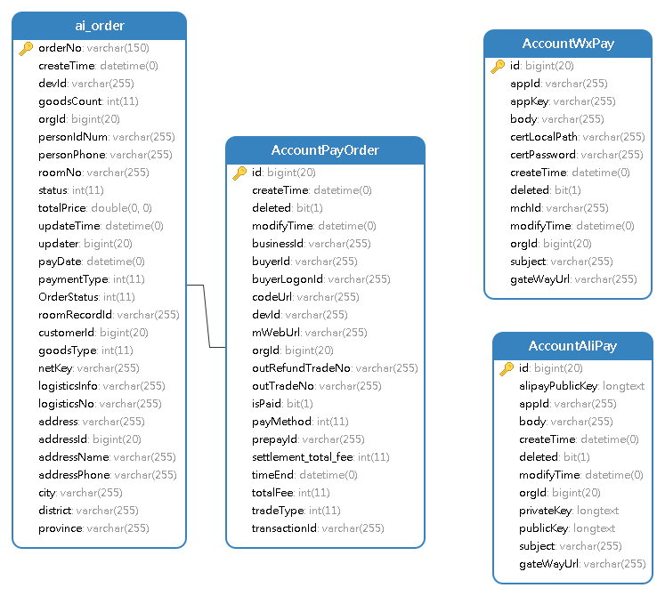
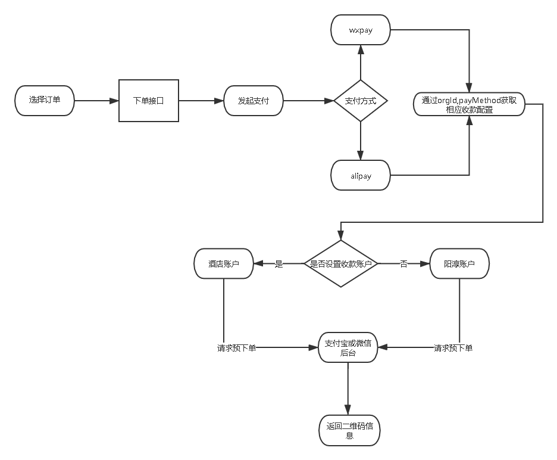

##  多账户支付系统该如何实现？

##  需求分析

*   由于智能酒店业务不断更新，随之而来的需求迭代不断增加。自从酒店商城项目上线之后，吸引了很多酒店热情入驻，既然是酒店那么支付是必不可少的功能，原来的单机模式
显然已经无法满足各个酒店方需求。单机模式下商城扫码支付，收款方都是阳淳账户代收，然后再打款到各个酒店平台，对账-开发票各种流程。财务麻烦，领导嫌弃，那么就做成多
租户模式吧。为酒店配置各自收款账户，商品捆绑酒店编码（唯一标识）下单到支付即可指定对应收款参数，生成收款码进行扫码支付，若未设置，则默认阳淳。典型的Software-as-a-Service系统。

##  er模型

*   order为订单表，关联商品good_id，酒店org_id。
*   accountPayOrder为内部订单表，关联orderNo（businessId）,支付回调支付结果存储，已经支付网关，支付方式等信息（支付方式：alipay,wxpay，pointpay）
*   accountAliPay为支付账户参数表， 存放各个酒店设置支付宝收款账户配置信息。

## 流程

*   支付结果回调就不赘述了,通过预下单产生的outTradeNo查询对应订单所在PayAccount

