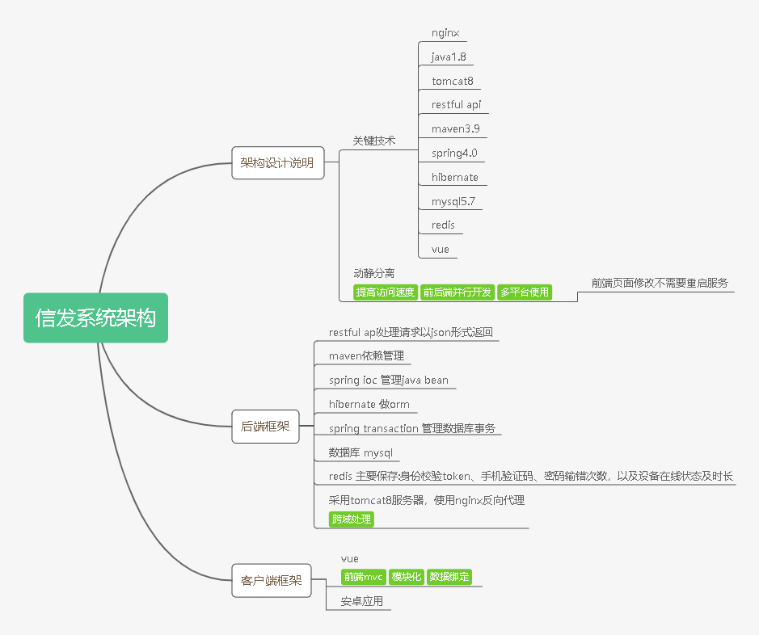
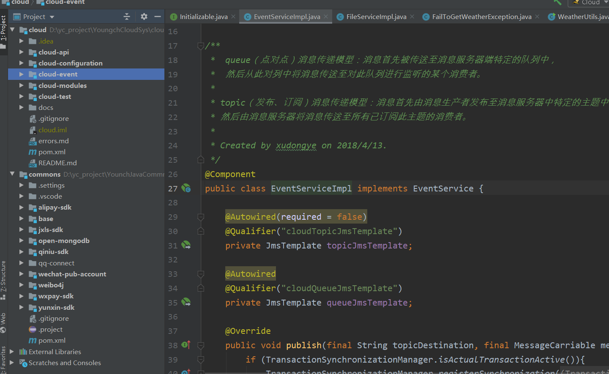

##  信发系统RestApi架构设计

*   咱们先画一个脑图捋一捋

*   架构目录展示

*   说明：
    1.  commons模块：组合后台开发所有的公共模块，被业务模块依赖，避免耦合与项目相关的定制化业务逻辑。
    2.  cloud模块：父级模块，依赖管理
        1.  cloud-modules：所有业务模块组合，
        2.  cloud-api：组织最终导出war包模块，主要业务功能由其依赖jar包提高，并且维护一些与应用直接相关的配置项。
        3.  cloud-configuration：动态配置项读取模块，如支付密钥，支付回调地址等配置
        4.  cloud-event：使用activemq异步消息队列服务器，封装事件发布服务，并预定事件消息的数据模型。
            目的：1.异步处理事务，加快相应速度，提高吞吐量2.消息队列提高访问峰值承载能力
        3.代码解耦，在不是紧耦合的模块之间传递消息来处理支线流程
        5.  cloud-test：使用spring-test测试组件，MockHttpServletRequest对象对rest-api进行测试，
        依赖注入来测试供其他业务模块调用的service接口
*   应用服务器
    *   承载主要业务模块，使用mysql,redis作为持久层
*   鉴权模块
    *   提高身份验证相关的所有服务：
        *   创建token
        *   删除token
        *   通过token查询用户权限，用户包括网站用户与管理员以及app用户
    *   根据token验证身份rest api暴露给其他服务器使用
    *   从mysql中查询用户及权限信息
    *   利用redis保存token,设置有效时间，将token值作为key以最快查询
    
