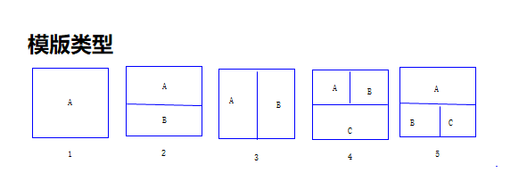
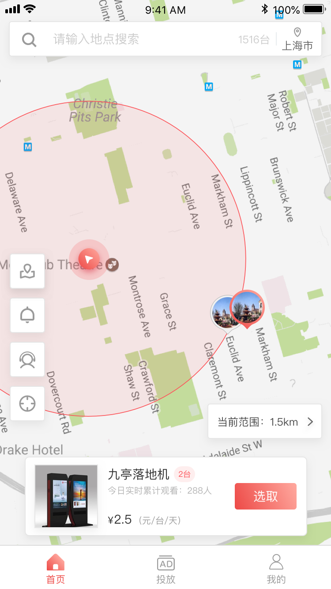
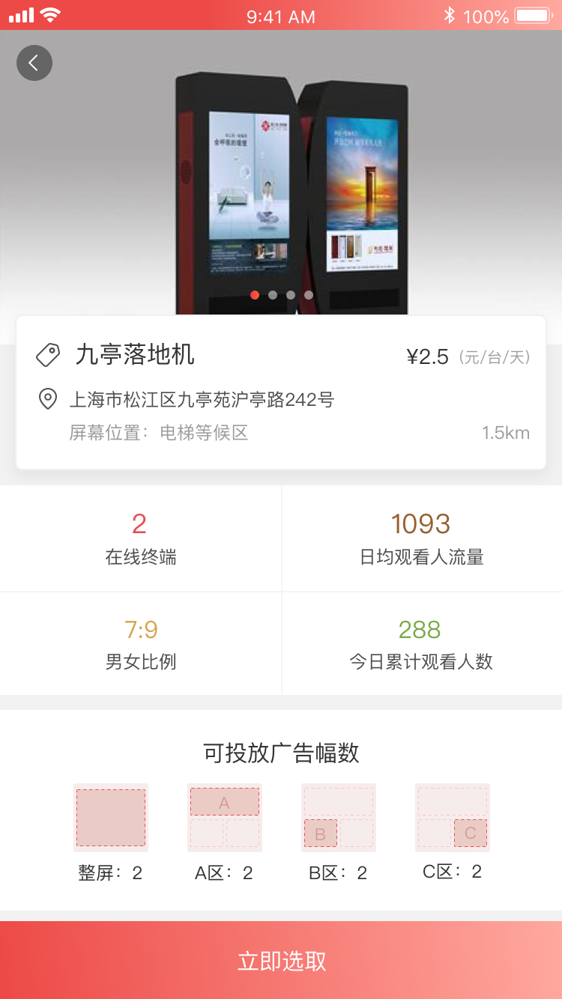
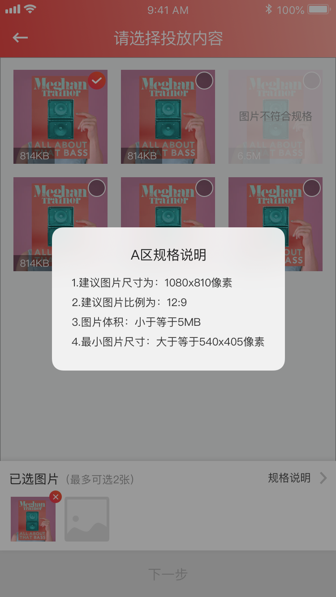
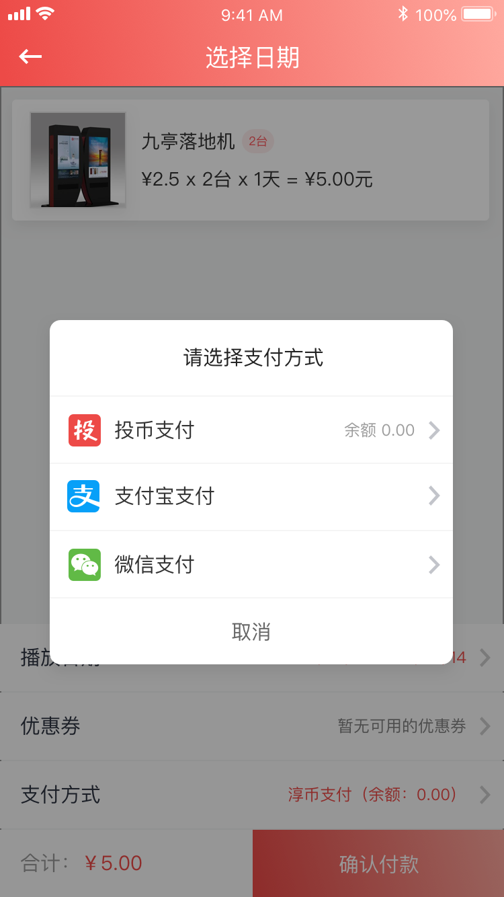
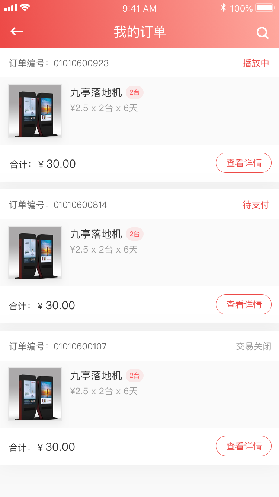
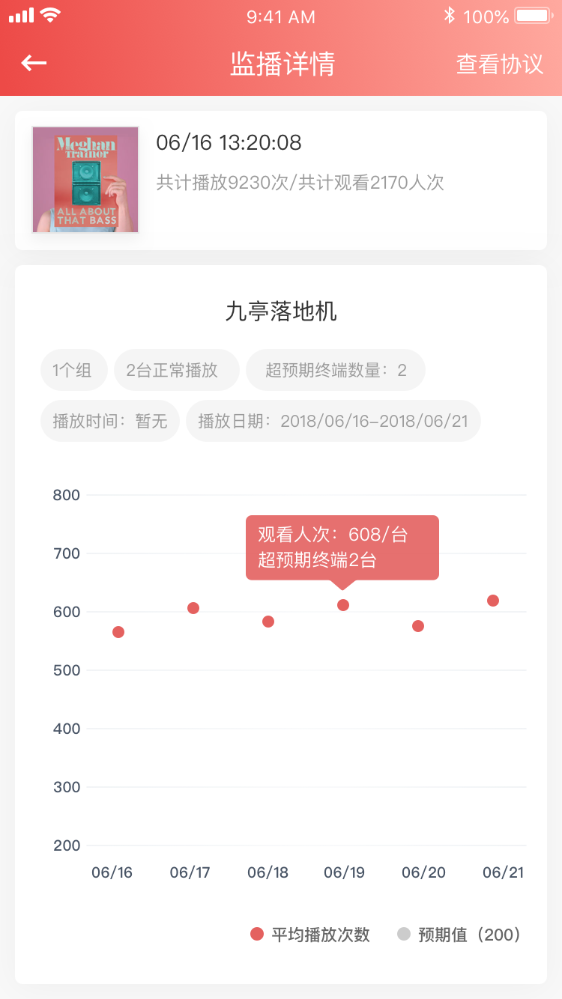
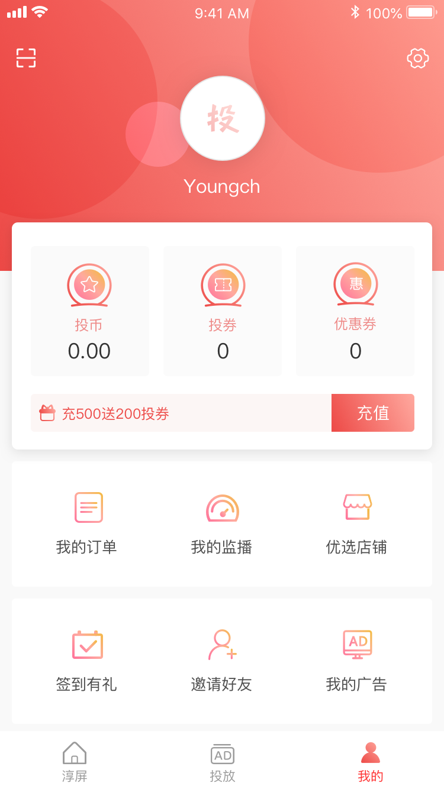

## 需求说明

*   投放模板

*   投屏系数(T)：A类全屏为系数1，B类半屏为系数0.5，C类四分之一屏系数为0.25
*   人流量(P)：人流量大于5000人/日，系数为2，小于5000人/日系数为1
*   点位系数(C)：自定义点位携带系数，类似折扣点最大为1
*   设备数量(D)：广告投放点位设备安装数量
*   基础费用(B)：普通投放随机投放模式10元，VIP通道预约时段投放模式100元，高人流量点位霸屏播放模式800元，定制全屏独播模式1000元
*   计费公式：TxPxCxBxD元/日。以普通播放，人流量大于5000人次，投屏系数为A类，点位系数为1，点位机器数量为20台为例 计价标准为：10x2x1x1x20=400元/天
*   投放协议及标准：投放合同为保证用户在投点位90%设备正常工作，每个点位每个广告投放必须满足每天播放量为200次以上，否则无法进行立即投放，可预约未来时间段
*   影响投放因素：广告审核时间过长，设备断电无法正常工作
*   设备工作时间：每个点位可远程设置自定义设置，远程开关机控制

*   实现效果(部分)：
*   点位选择

*   投屏系数：

*   投放内容

*   下单支付

*   订单列表

*   广告监播

*   主页内容

