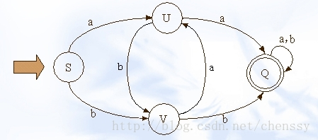
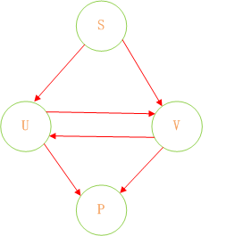
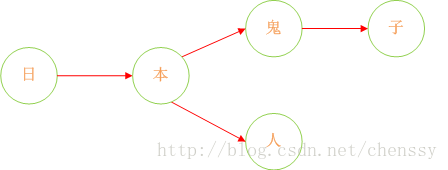
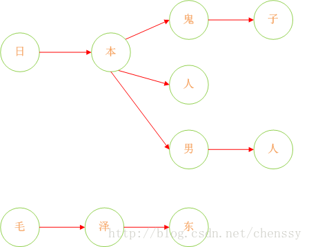
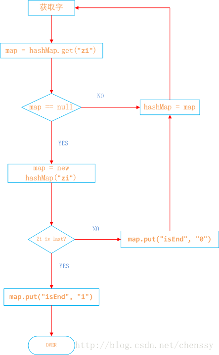

-   DFA算法简介

    -   敏感词过滤是一个网站必不可少的功能，那么如何设计一个科学并且高效过滤算法是非要有必要的。一般的开发人员首先考虑的肯定是简单的匹配规则，可以实现，但是效率很低。再高级一点的就是正则表达式，但终究都不可取。
    -   DFA全称(Deterministic Finite Automaton)，即确定有穷自动机。
    
    -   特征：有一个有序集集合和一些从一个状态通向另一个状态的边，每条边上标记一个符号，其中状态有初态和终态。
    -   区别：不同于不确定的有限自动机，DFA中不会从同一状态出发的两边标志有相同的符号。
    -   实现：通过event和当前state得到下一个state，即event+state=nextstate
    
    -   （S、U、V、Q）都是状态，小写字母a、b为动作
    -   关系如下：
    ````
                a b b 
    S -----> U S -----> V U -----> V
    ````
    -   在DFA算法里面几乎没有什么计算
-   Java实现DFA算法实现敏感词过滤
    
    -   我们可以认为，通过S query U、V，通过U query V、P，通过V query U P。通过这样的转变我们可以将状态的转换转变为使用Java集合的查找。
    -   举个栗子：假设我们的敏感词库里面有日本人，日本鬼子，毛.泽.东
    -   首先：query 日 ---> {本}、query 本 --->{人、鬼子}、query 人 --->{null}、query 鬼 ---> {子}。形如下结构:
    
    
    
    -   这样我们就将我们的敏感词库构建成了一个类似与一颗一颗的树，这样我们判断一个词是否为敏感词时就大大减少了检索的匹配范围。比如我们要判断日本人，根据第一个字我们就可以确认需要检索的是那棵树，然后再在这棵树中进行检索。
    -   但是如何来判断一个敏感词已经结束了呢？利用标识位来判断。所以对于这个关键是如何来构建一棵棵这样的敏感词树。下面我已Java中的HashMap为例来实现DFA算法。具体过程如下：
    -   日本人，日本鬼子为例
        
        -   1、在hashMap中查询“日”看其是否在hashMap中存在，如果不存在，则证明已“日”开头的敏感词还不存在，则我们直接构建这样的一棵树。跳至3。
            
        -   2、如果在hashMap中查找到了，表明存在以“日”开头的敏感词，设置hashMap = hashMap.get("日")，跳至1，依次匹配“本”、“人”。
            
        -   3、判断该字是否为该词中的最后一个字。若是表示敏感词结束，设置标志位isEnd = 1，否则设置标志位isEnd = 0；
        
            
            
-   程序如下：

    ````java
    /** 
         * 读取敏感词库，将敏感词放入HashSet中，构建一个DFA算法模型：<br> 
         * 中 = { 
         *      isEnd = 0 
         *      国 = {<br> 
         *           isEnd = 1 
         *           人 = {isEnd = 0 
         *                民 = {isEnd = 1} 
         *                } 
         *           男  = { 
         *                  isEnd = 0 
         *                   人 = { 
         *                        isEnd = 1 
         *                       } 
         *               } 
         *           } 
         *      } 
         *  五 = { 
         *      isEnd = 0 
         *      星 = { 
         *          isEnd = 0 
         *          红 = { 
         *              isEnd = 0 
         *              旗 = { 
         *                   isEnd = 1 
         *                  } 
         *              } 
         *          } 
         *      } 
         * @param keyWordSet  敏感词库 
         * @version 1.0 
         */  
        @SuppressWarnings({ "rawtypes", "unchecked" })  
        private void addSensitiveWordToHashMap(Set<String> keyWordSet) {  
            sensitiveWordMap = new HashMap(keyWordSet.size());     //初始化敏感词容器，减少扩容操作  
            String key = null;    
            Map nowMap = null;  
            Map<String, String> newWorMap = null;  
            //迭代keyWordSet  
            Iterator<String> iterator = keyWordSet.iterator();  
            while(iterator.hasNext()){  
                key = iterator.next();    //关键字  
                nowMap = sensitiveWordMap;  
                for(int i = 0 ; i < key.length() ; i++){  
                    char keyChar = key.charAt(i);       //转换成char型  
                    Object wordMap = nowMap.get(keyChar);       //获取  
                      
                    if(wordMap != null){        //如果存在该key，直接赋值  
                        nowMap = (Map) wordMap;  
                    }  
                    else{     //不存在则，则构建一个map，同时将isEnd设置为0，因为他不是最后一个  
                        newWorMap = new HashMap<String,String>();  
                        newWorMap.put("isEnd", "0");     //不是最后一个  
                        nowMap.put(keyChar, newWorMap);  
                        nowMap = newWorMap;  
                    }  
                      
                    if(i == key.length() - 1){  
                        nowMap.put("isEnd", "1");    //最后一个  
                    }  
                }  
            }  
        }
    
        运行得到的hashMap结构如下：
        {五={星={红={isEnd=0, 旗={isEnd=1}}, isEnd=0}, isEnd=0}, 中={isEnd=0, 国={isEnd=0, 人={isEnd=1}, 男={isEnd=0, 人={isEnd=1}}}}}
    ````
    
-   如何实现检索：

    -   假设我们检索“中国人民万岁”
    
        -   1、第一个字“中”，我们在hashMap中可以找到。得到一个新的map = hashMap.get("")。
        -   2、如果map == null，则不是敏感词。否则跳至3
        -   3、获取map中的isEnd，通过isEnd是否等于1来判断该词是否为最后一个。如果isEnd == 1表示该词为敏感词，否则跳至1。
        -   通过这个步骤我们可以判断“中国人民”为敏感词，但是如果我们输入“中国女人”则不是敏感词了。

    ````java
    /** 
         * 检查文字中是否包含敏感字符，检查规则如下：<br> 
         * @param txt 
         * @param beginIndex 
         * @param matchType 
         * @return，如果存在，则返回敏感词字符的长度，不存在返回0 
         * @version 1.0 
         */  
        @SuppressWarnings({ "rawtypes"})  
        public int CheckSensitiveWord(String txt,int beginIndex,int matchType){  
            boolean  flag = false;    //敏感词结束标识位：用于敏感词只有1位的情况  
            int matchFlag = 0;     //匹配标识数默认为0  
            char word = 0;  
            Map nowMap = sensitiveWordMap;  
            for(int i = beginIndex; i < txt.length() ; i++){  
                word = txt.charAt(i);  
                nowMap = (Map) nowMap.get(word);     //获取指定key  
                if(nowMap != null){     //存在，则判断是否为最后一个  
                    matchFlag++;     //找到相应key，匹配标识+1   
                    if("1".equals(nowMap.get("isEnd"))){       //如果为最后一个匹配规则,结束循环，返回匹配标识数  
                        flag = true;       //结束标志位为true     
                        if(SensitivewordFilter.minMatchTYpe == matchType){    //最小规则，直接返回,最大规则还需继续查找  
                            break;  
                        }  
                    }  
                }  
                else{     //不存在，直接返回  
                    break;  
                }  
            }  
            if(matchFlag < 2 && !flag){       
                matchFlag = 0;  
            }  
            return matchFlag;  
        }  
    ````
-   测试：

    ````java
    public static void main(String[] args) {  
            SensitivewordFilter filter = new SensitivewordFilter();  
            System.out.println("敏感词的数量：" + filter.sensitiveWordMap.size());  
            String string = "太多的伤感情怀也许只局限于饲养基地 荧幕中的情节，主人公尝试着去用某种方式渐渐的很潇洒地释自杀指南怀那些自己经历的伤感。"  
                            + "然后法.轮.功 我们的扮演的角色就是跟随着主人公的喜红客联盟 怒哀乐而过于牵强的把自己的情感也附加于银幕情节中，然后感动就流泪，"  
                            + "难过就躺在某一个人的怀里尽情的阐述心扉或者手机卡复制器一个人一杯红酒一部电影在夜三.级.片 深人静的晚上，关上电话静静的发呆着。";  
            System.out.println("待检测语句字数：" + string.length());  
            long beginTime = System.currentTimeMillis();  
            Set<String> set = filter.getSensitiveWord(string, 1);  
            long endTime = System.currentTimeMillis();  
            System.out.println("语句中包含敏感词的个数为：" + set.size() + "。包含：" + set);  
            System.out.println("总共消耗时间为：" + (endTime - beginTime));  
        } 
    ````

-   [敏感词库](../../static/sensitiveword/dictionary.txt)


