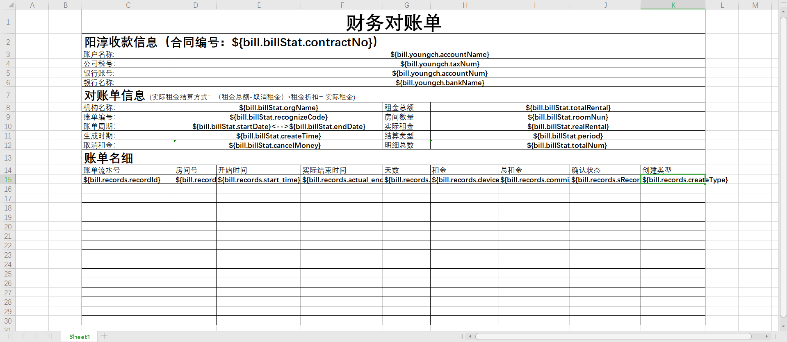
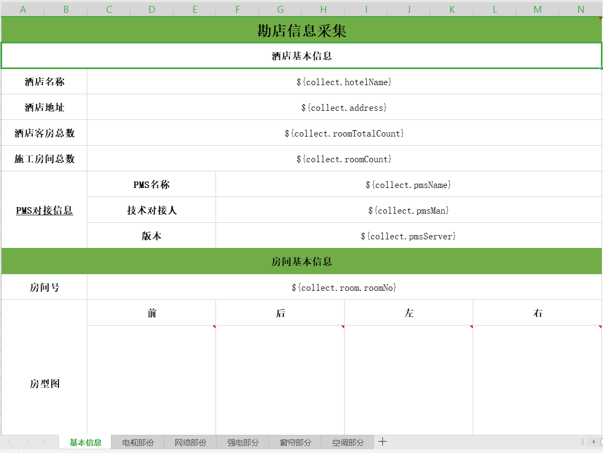
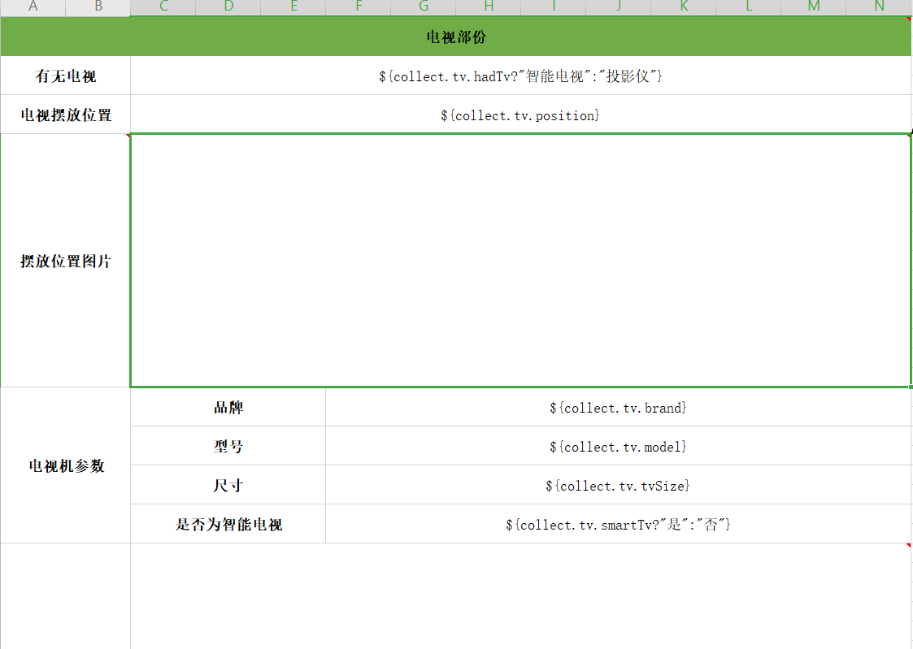
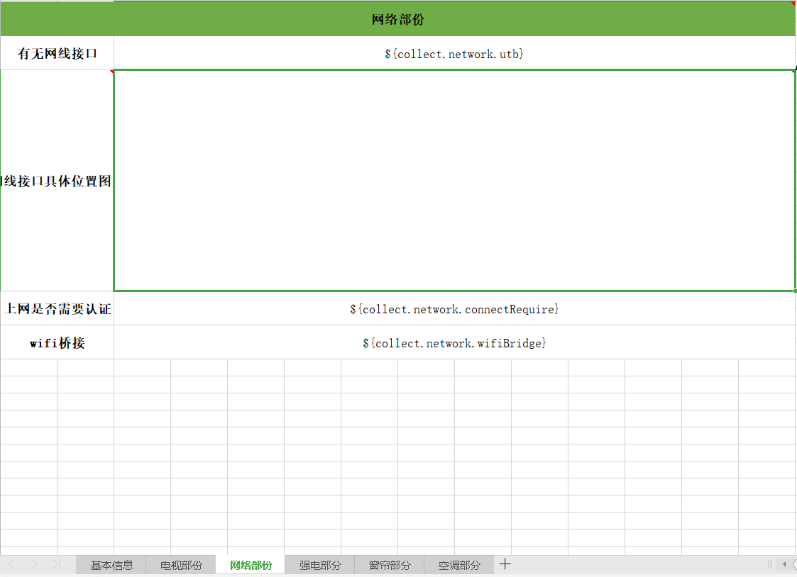
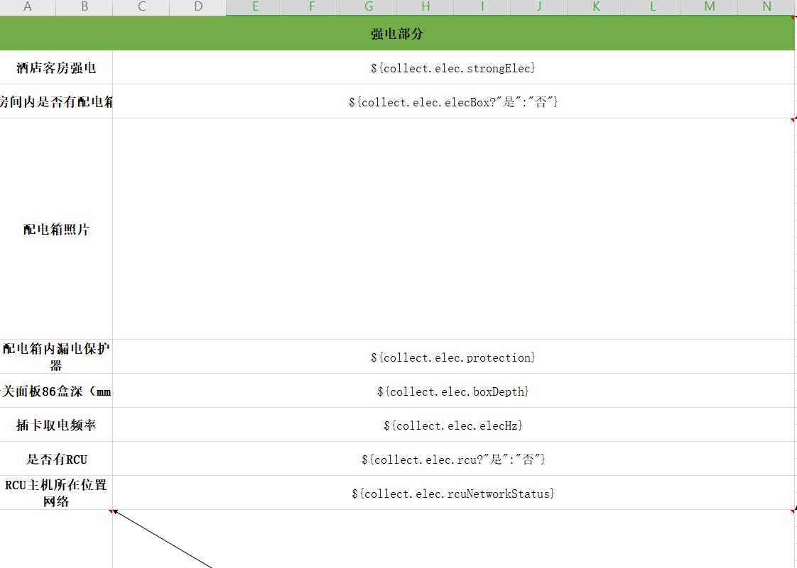
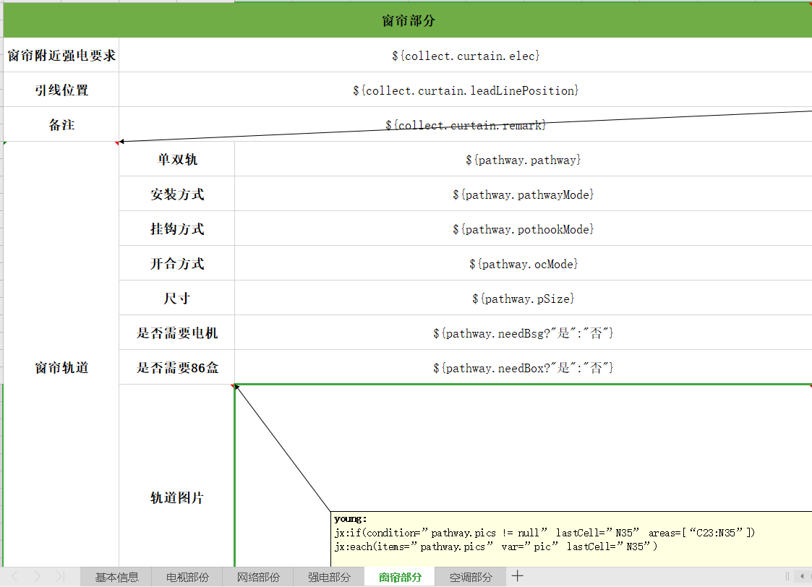
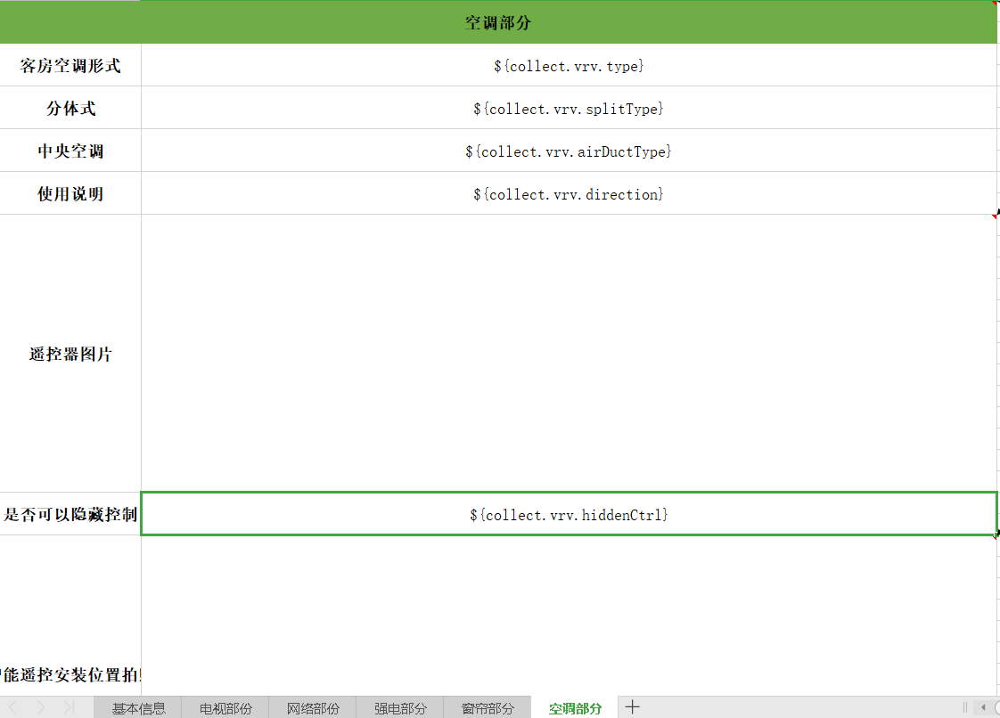
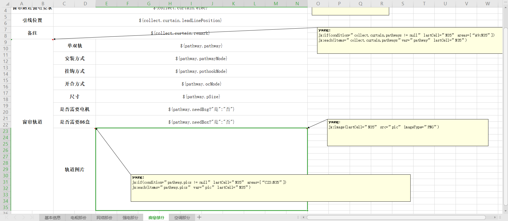
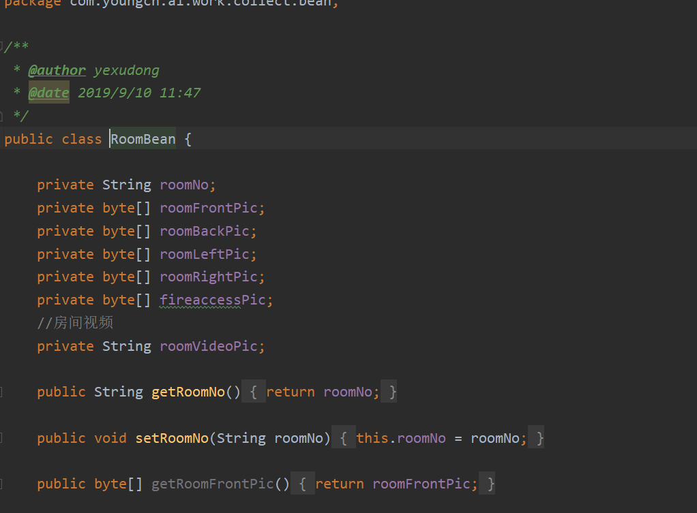
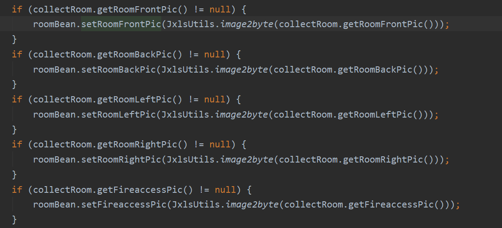

### java集成jxls实现Excle导出功能

-   项目需求(场景描述)：酒店租用智能生成设备佣金账单
    
    -   酒店安装智能设备后，设备每5分钟上报一次状态信息，后台接到上报信息之后并缓存下设备连续在线时间
    -   连续在线(duration)满4小时(timeInterval = currentTime-lastReportTime >= 10min,duration=0)，记录一笔设备使用佣金
    -   每一个酒店organization,不同房间设备在同时上报
    -   账单范围以及单笔账单归属日期，以开始时间(startTime)为参考值,条件：startTime > 12:00,则todayDate - 1 day(即startTime=2019-12-27 11:59:59,则此笔账单recordDate=2019-12-26)。
    -   账单周期(周（每周二凌晨2点统计一次上周账单），月（每月2号凌晨2点统计一次上月账单）)starDate-endDate

-   回归正题，集成jxls,maven项目为例
    -   依赖
    ````xml
            <dependency>
                <groupId>org.jxls</groupId>
                <artifactId>jxls</artifactId>
                <version>2.4.6</version>
            </dependency>
            <dependency>
                <groupId>org.jxls</groupId>
                <artifactId>jxls-poi</artifactId>
                <version>1.0.9</version>
            </dependency>
            <dependency>
                <groupId>org.jxls</groupId>
                <artifactId>jxls-jexcel</artifactId>
                <version>1.0.6</version>
            </dependency>
    ````
    -   代码：
    ````java
    /**
     * @author yexudong
     * @date 2019/1/11 16:23
     */
    public class BillExcelExport {
    
        private static String templateFileName = "D:\\yc_learn_project\\jxls\\jxls-examples\\src\\main\\resources\\templates\\对账单.xlsx";
        private static String destFileName = "D:\\var\\yangchun_对账单.xlsx";
    
        public static void main(String[] args) throws IOException, ParsePropertyException, InvalidFormatException {
            if (args.length >= 2) {
                templateFileName = args[0];
                destFileName = args[1];
            }
    
    
            YoungchAccount account = new YoungchAccount("阳淳股份", "123245335345346", "中国银行");
    
            BillStat billStat = new BillStat("演示箱", 1000.0D, "231234", 1D, "2018-12-31", "2019-01-06", 1000.0D, "2018-01-07 02:00:00", 1);
            BillDepartment department = new BillDepartment("阳淳财务对账单", account, billStat);
            department.addRecord(new BillRecordDetail("s213aeqwdhb123123", "101", "2018-12-31 12:00:00", "2019-01-01", 1, 12.0, 12.0, "device"));
            department.addRecord(new BillRecordDetail("s213aeqwdhb123123", "101", "2018-12-31 12:00:00", "2019-01-01", 1, 12.0, 12.0, "device"));
            department.addRecord(new BillRecordDetail("s213aeqwdhb123123", "101", "2018-12-31 12:00:00", "2019-01-01", 1, 12.0, 12.0, "device"));
            department.addRecord(new BillRecordDetail("s213aeqwdhb123123", "101", "2018-12-31 12:00:00", "2019-01-01", 1, 12.0, 12.0, "device"));
            department.addRecord(new BillRecordDetail("s213aeqwdhb123123", "101", "2018-12-31 12:00:00", "2019-01-01", 1, 12.0, 12.0, "device"));
            department.addRecord(new BillRecordDetail("s213aeqwdhb123123", "101", "2018-12-31 12:00:00", "2019-01-01", 1, 12.0, 12.0, "device"));
            Map beans = new HashMap();
            beans.put("bill", department);
            writeExcel(beans, destFileName, templateFileName);
        }
    
        public static void writeExcel(Map beans, String destFileName, String templateFileName) throws IOException, InvalidFormatException {
    
            XLSTransformer transformer = new XLSTransformer();
    //        transformer.registerRowProcessor(new StyleRowProcessor("bill.records"));
            transformer.transformXLS(templateFileName, beans, destFileName);
        }
    }

    ````
    -   调用：
    ````java
        @ApiOperation(
                value = "管理员生成周期账单明细excel表单",
                notes = "生成周期账单",
                response = ApiResponseBody.class
        )
        @ApiImplicitParam(name = "u_id", value = "调试模式", paramType = "query", dataType = "String", defaultValue = "1")
        @RequestMapping(value = "/period-excel", method = RequestMethod.GET)
        @UserAuthenticationRequired(
                needPermission = {RoleConstants.Permissions.CREATE_UPDATE_ONLY},
                doLog = true,
                moduleName = "bill",
                operateType = "get",
                description = "生成对账单#{#billId}excel")
        public ResponseEntity getExcel(HttpServletRequest request, HttpServletResponse response, UserAccessToken uat,
                                       @RequestParam String billId) throws Exception {
            ApiResponseBody<String> apiResponseBody = new ApiResponseBody<>();
    
            try {
                //导出数据bean
                BillDepartment department = billDepartment(billId);
                Map beans = new HashMap();
                beans.put("bill", department);
                String destFileName = simpleDateFormat.format(new Date()) + fileName.replace("{{orgName}}", department.getBillStat().getOrgName());
                //模板路径
                String templateFileName = delegate.getConfiguration().getFile().getExcelPath() + "bill_template.xlsx";
                BillExcelExport.writeExcel(beans,
                        delegate.getConfiguration().getFile().getExcelPath() + destFileName,
                        templateFileName);
                //拼装excel网络路径
                String excelUrl = delegate.getConfiguration().getFile().
                        getUrlPrefix().replace("{{media}}", "excel") + destFileName;
                billService.updateExcelUrl(billId, excelUrl);
                apiResponseBody.setCode(200);
                apiResponseBody.setMessage("success!");
                apiResponseBody.setData(excelUrl);
            } catch (IllegalArgumentException ie) {
                apiResponseBody.setCode(400);
                apiResponseBody.setMessage(ie.getMessage());
            }
            return new ResponseEntity(apiResponseBody, HttpStatus.OK);
        }
    ````
    -   excel模板
    
    
### jxls多sheet导出

-   智能酒店安装设备流程之勘店

    -   在成为智能酒店设备之前，实地勘察酒店环境是非常有必要的
    -   勘店内容划分为：
    
        -   酒店基本信息
        
        -   电视部分
        
        -   网络部分
        
        -   强电部分
        
        -   窗帘部分
        
        -   空调部分
        
    -   模板批注才是精髓
    
    
    -   代码：
    ````java
    /**
     * @author yexudong
     * @date 2019/9/10 10:02
     */
    public class JxlsUtils {
        static {
            //添加自定义指令（可覆盖jxls原指令）
            XlsCommentAreaBuilder.addCommandMapping("image", ImageCommand.class);
            XlsCommentAreaBuilder.addCommandMapping("each", EachCommand.class);
            XlsCommentAreaBuilder.addCommandMapping("merge", MergeCommand.class);
            XlsCommentAreaBuilder.addCommandMapping("link", LinkCommand.class);
        }
    
        public static void exportExcel(InputStream is, OutputStream os, Map<String, Object>
                model) throws IOException {
            Context context = PoiTransformer.createInitialContext();
            if (model != null) {
                for (Map.Entry<String, Object> entry : model.entrySet()) {
                    context.putVar(entry.getKey(), entry.getValue());
                }
            }
            JxlsHelper jxlsHelper = JxlsHelper.getInstance();
            Transformer transformer = jxlsHelper.createTransformer(is, os);
            //获得配置
            JexlExpressionEvaluator evaluator = (JexlExpressionEvaluator) transformer.getTransformationConfig().getExpressionEvaluator();
            //设置静默模式，不报警告
            evaluator.getJexlEngine().setSilent(true);
            //函数强制，自定义功能
            Map<String, Object> funcs = new HashMap<String, Object>();
            funcs.put("jx", new JxlsUtils());    //添加自定义功能
            evaluator.getJexlEngine().setFunctions(funcs);
            //必须要这个，否者表格函数统计会错乱
            jxlsHelper.setUseFastFormulaProcessor(false).processTemplate(context, transformer);
        }
    
        public static void exportExcel(File xls, File out, Map<String, Object> model) throws FileNotFoundException, IOException {
            exportExcel(new FileInputStream(xls), new FileOutputStream(out), model);
        }
    
        public static void exportExcel(String templatePath, OutputStream os, Map<String, Object> model) throws Exception {
            File template = getTemplate(templatePath);
            if (template != null) {
                exportExcel(new FileInputStream(template), os, model);
            } else {
                throw new Exception("Excel 模板未找到。");
            }
        }
    
        //获取jxls模版文件
        public static File getTemplate(String path) {
            File template = new File(path);
            if (template.exists()) {
                return template;
            }
            return null;
        }
    
        // 日期格式化
        public String dateFmt(Date date, String fmt) {
            if (date == null) {
                return "";
            }
            try {
                SimpleDateFormat dateFmt = new SimpleDateFormat(fmt);
                return dateFmt.format(date);
            } catch (Exception e) {
                e.printStackTrace();
            }
            return "";
        }
    
        // if判断
        public Object ifelse(boolean b, Object o1, Object o2) {
            return b ? o1 : o2;
        }
    
        /**
         * 图片转为byte数组
         *
         * @param path
         * @return
         */
        public static byte[] image2byte(String path) {
            byte[] data = null;
            URL url = null;
            InputStream input = null;
            try {
                url = new URL(path);
                HttpURLConnection httpUrl = (HttpURLConnection) url.openConnection();
                httpUrl.connect();
                httpUrl.getInputStream();
                input = httpUrl.getInputStream();
                ByteArrayOutputStream output = new ByteArrayOutputStream();
                byte[] buf = new byte[1024];
                int numBytesRead = 0;
                while ((numBytesRead = input.read(buf)) != -1) {
                    output.write(buf, 0, numBytesRead);
                }
                data = output.toByteArray();
                output.close();
                input.close();
                return data;
            } catch (Exception e) {
                e.printStackTrace();
                return null;
            }
        }
    
        /**
         * 在线图片转为byte数组
         *
         * @param path
         * @return
         */
        public static byte[] onlineImage2byte(String path) {
            byte[] data = null;
            URL url = null;
            InputStream input = null;
            try {
                url = new URL(path);
                HttpURLConnection httpUrl = (HttpURLConnection) url.openConnection();
                httpUrl.connect();
                httpUrl.getInputStream();
                input = httpUrl.getInputStream();
                ByteArrayOutputStream output = new ByteArrayOutputStream();
                byte[] buf = new byte[1024];
                int numBytesRead = 0;
                while ((numBytesRead = input.read(buf)) != -1) {
                    output.write(buf, 0, numBytesRead);
                }
                data = output.toByteArray();
                output.close();
                input.close();
                return data;
            } catch (Exception e) {
                e.printStackTrace();
                return null;
            }
    
        }
    }
    ````
    -   调用
    ````java
    private String createExcel(CollectExcelBean excelBean) {
            String excelUrl = null;
            try {
                String destFileName = fileName.replace("{{hotelName}}", excelBean.getHotelName())
                        .replace("{{roomNo}}", excelBean.getRoom().getRoomNo())
                        .replace("{{timestamp}}", String.valueOf(System.currentTimeMillis()));
                String templatePath = delegate.getConfiguration().getFile().getExcelPath() + "collect_template.xlsx";
                LOGGER.info("template excel dest file path: {} ", templatePath);
                Map<String, Object> data = new HashMap<>();
                data.put("collect", excelBean);
                OutputStream os = new FileOutputStream(delegate.getConfiguration().getFile().getExcelPath() + destFileName);
                //调用封装的工具类，传入模板路径，输出流，和装有数据的Map,按照模板导出
                JxlsUtils.exportExcel(templatePath, os, data);
                os.close();
                excelUrl = delegate.getConfiguration().getFile().
                        getUrlPrefix().replace("{{media}}", "excel") + destFileName;
                excelBean.setExcelUrl(excelUrl);
                LOGGER.info("excel dest file {} generate new excel {} success!", destFileName, excelUrl);
            } catch (Exception e) {
                e.printStackTrace();
                LOGGER.error(" excel generate failure! reason :{}", e.getMessage());
            }
            return excelUrl;
        }
    ````
    -   实体部分参数
    ````java
    public class CollectExcelBean {
    
        private String excelUrl;
        private String exportPerson;
        private Long exportPersonId;
        private String hotelName;
        private String address;
        //施工房间数
        private int roomCount;
        //酒店总房间数
        private int roomTotalCount;
        private String pmsName;
        //对接人
        private String pmsMan;
        //服务器，局域网，云端
        private String pmsServer;
        //房间信息
        private RoomBean room;
    
        private TvBean tv;
    
        private NetworkBean network;
    
        private CurtainBean curtain;
    
        private VrvBean vrv;
    
        private ElecBean elec;
    
        public ElecBean getElec() {
            return elec;
        }
    
        public void setElec(ElecBean elec) {
            this.elec = elec;
        }
    
        public VrvBean getVrv() {
            return vrv;
        }
    
        public void setVrv(VrvBean vrv) {
            this.vrv = vrv;
        }
    
        public CurtainBean getCurtain() {
            return curtain;
        }
    
        public void setCurtain(CurtainBean curtain) {
            this.curtain = curtain;
        }
    
        public NetworkBean getNetwork() {
            return network;
        }
    
        public void setNetwork(NetworkBean network) {
            this.network = network;
        }
    
        public TvBean getTv() {
            return tv;
        }
    
        public void setTv(TvBean tv) {
            this.tv = tv;
        }
    
        public String getExcelUrl() {
            return excelUrl;
        }
    
        public void setExcelUrl(String excelUrl) {
            this.excelUrl = excelUrl;
        }
    
        public String getExportPerson() {
            return exportPerson;
        }
    
        public void setExportPerson(String exportPerson) {
            this.exportPerson = exportPerson;
        }
    
        public Long getExportPersonId() {
            return exportPersonId;
        }
    
        public void setExportPersonId(Long exportPersonId) {
            this.exportPersonId = exportPersonId;
        }
    
        public String getHotelName() {
            return hotelName;
        }
    
        public void setHotelName(String hotelName) {
            this.hotelName = hotelName;
        }
    
        public String getAddress() {
            return address;
        }
    
        public void setAddress(String address) {
            this.address = address;
        }
    
        public int getRoomCount() {
            return roomCount;
        }
    
        public void setRoomCount(int roomCount) {
            this.roomCount = roomCount;
        }
    
        public int getRoomTotalCount() {
            return roomTotalCount;
        }
    
        public void setRoomTotalCount(int roomTotalCount) {
            this.roomTotalCount = roomTotalCount;
        }
    
        public String getPmsName() {
            return pmsName;
        }
    
        public void setPmsName(String pmsName) {
            this.pmsName = pmsName;
        }
    
        public String getPmsMan() {
            return pmsMan;
        }
    
        public void setPmsMan(String pmsMan) {
            this.pmsMan = pmsMan;
        }
    
        public String getPmsServer() {
            return pmsServer;
        }
    
        public void setPmsServer(String pmsServer) {
            this.pmsServer = pmsServer;
        }
    
        public RoomBean getRoom() {
            return room;
        }
    
        public void setRoom(RoomBean room) {
            this.room = room;
        }
    }
    ````
    -   图片链接一定要转成byte[],否则无法显示
    
    