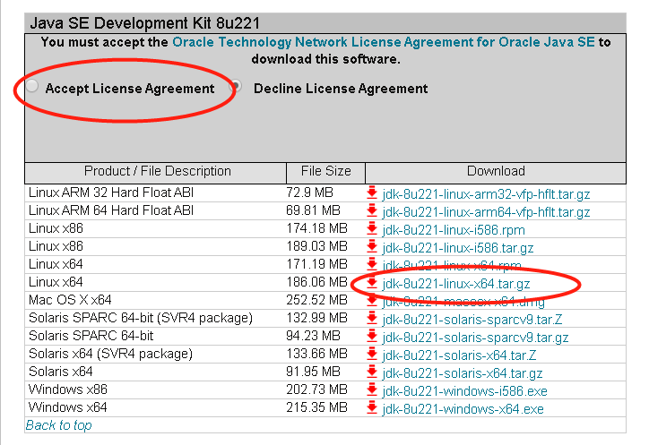
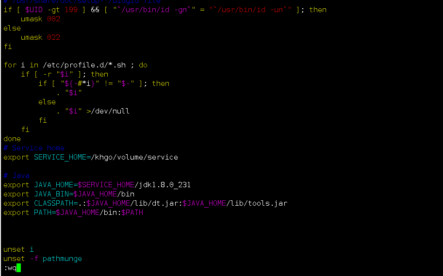
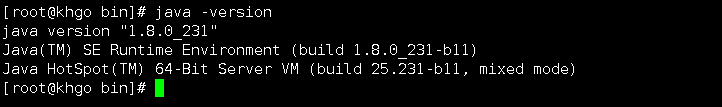
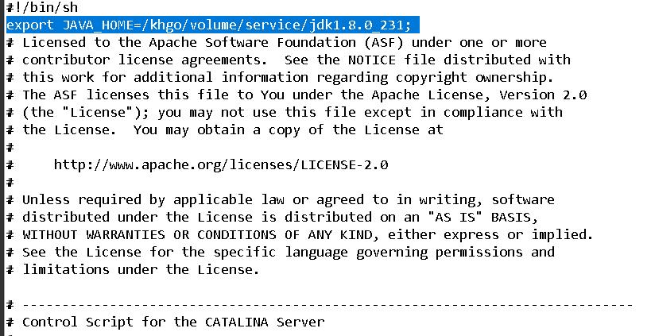
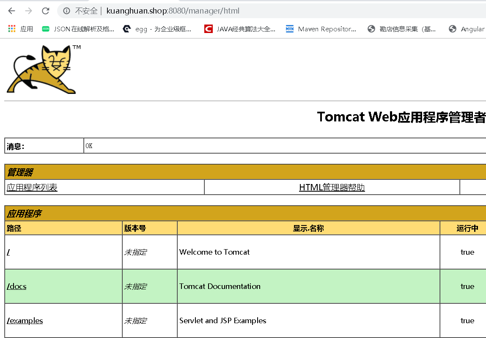
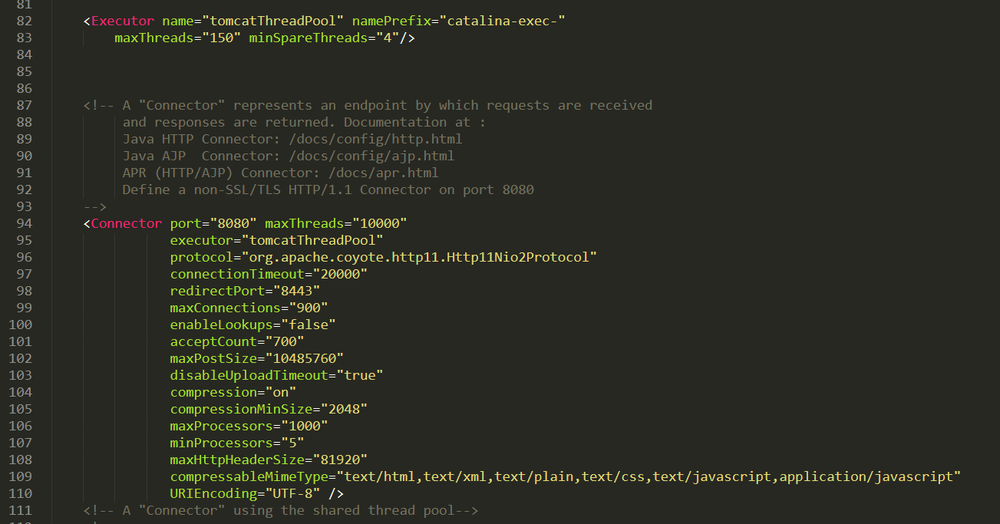
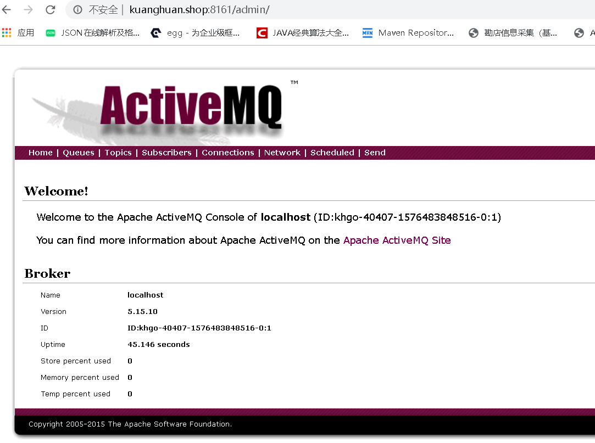

### 安装JDK8

* [jdk-8u211-linux-x64.tar.tar.gz](https://www.oracle.com/technetwork/java/javase/downloads/java-archive-javase8u211-later-5573849.html)
* 选择与自己系统相匹配版本，我的是centOs7 64位，选择的是以tar.gz结尾

* 通过FTP工具将下载好的jdk-8u211-linux-x64.tar.gz传输到/khgo/volume/service
* 解压
    ````
    tar -zxvf jdk-8u211-linux-x64.tar.tar.gz
    ````
* 编辑/etc/profile

* 生效命令：
    ````
    source /etc/profile
    ````
* 测试命令
    ````
   java -version
    ````
   
* 出现上面的信息,说明安装成功！
 
### 安装Tomcat8
    
* [apache-tomcat-8.5.47.tar.gz](https://archive.apache.org/dist/tomcat/tomcat-8/v8.5.47/bin/apache-tomcat-8.5.47.tar.gz)
    ````
    cd /khgo/volume/service/
    wget https://archive.apache.org/dist/tomcat/tomcat-8/v8.5.47/bin/apache-tomcat-8.5.47.tar.gz
    ````
* 解压安装包
    ````
    tar -zxvf apache-tomcat-8.5.47.tar.gz
    ````
* 设置为系统服务
    ````
    # tomcat8080.service
    # vim /lib/systemd/system/tomcat8080.service
    [Unit]
    Description=Tomcat
    After=syslog.target network.target remote-fs.target nss-lookup.target
    
    [Service]
    Type=oneshot
    ExecStart=/khgo/volume/service/apache-tomcat-8.5.47/bin/startup.sh
    ExecStop=/khgo/volume/service/apache-tomcat-8.5.47/bin/shutdown.sh
    ExecReload=/bin/kill -s HUP $MAINPID
    RemainAfterExit=yes
    
    [Install]
    WantedBy=multi-user.target
    ````
* 编辑catalina.sh，由于Tomcat默认情况下会用系统的环境变量中找到JAVA_HOME和JRE_HOME。但是有的时候我们需要不同版本的JDK共存。
    ````
    export JAVA_HOME=/khgo/volume/service/jdk1.8.0_231;
    #或用的全一点如下设置（用上面只设置一个JAVA_HOME足够了）：
    export JAVA_HOME=/usr/local/java/jdk1.8.0_231
    export JRE_HOME=/usr/local/java/jdk1.8.0_231/jre
    export PATH=$PATH:/usr/local/java/jdk1.8.0_231/bin
    export CLASSPATH=/usr/local/java/jdk1.8.0_231/lib:/usr/local/java/jdk1.8.0_231/jre/lib
    ````
    如图：
    
* 添加完即可
    ````
    systemctl enable|status|start|restart|stop tomcat8080.service
    ````
    安装成功！
    
* Tomcat8优化
    
    元素属性：
    ````
    <Executor 
        name="tomcatThreadPool"        <!--线程名称-->
        namePrefix="catalina-exec-" 
        maxThreads="150"               <!--最大处理连接数线程-->
        minSpareThreads="4" />         <!--保留最少线程数-->
    <!-- 将原有的Connector 替换为带有线程池的Connector如下,其实servlet.xml已经有了,只要打开就可以了,将原来的去掉   -->
    <Connector 
        port="8080"                     <!-- Connector创建server socket并等待连接的TCP端口号。操作系统在特定的IP地址上只允许一个服务器应用程序监听特定的端口 -->
        maxThreads="10000"              <!-- 该线程池可以容纳的最大线程数、默认值：200 -->
        executor="tomcatThreadPool"     
        protocol="org.apache.coyote.http11.Http11Nio2Protocol"  <!-- 为了使用HTTP处理器，该属性值必须为HTTP/1.1（缺省值） -->
        connectionTimeout="20000"
        redirectPort="8443"             <!-- 如果Connector支持非SSL请求，在收到一个要求使用SSL传输的请求以后，Catalina会自动将该请求重定向到这里指定的端口号 -->
        maxConnections="900"
        enableLookups="false"           <!-- 如果希望调用request.getRemoteHost()进行DNS查询，以返回远程客户的实际主机名，将enableLookups设为true。如果希望忽略DNS查询，仅仅返回IP地址，设为false（这样提高了性能）。缺省情况下，DNS查询是使能的 -->
        acceptCount="700"               <!-- 接受最大并发数量 ,超过这个数量就会返回连接被拒绝 -->
        maxPostSize="10485760"
        disableUploadTimeout="true"
        compression="on"
        compressionMinSize="2048"
        maxProcessors="1000"            <!-- 同时处理请求的最大数 -->
        minProcessors="5"               <!-- 同时处理请求的最小数 -->
        maxHttpHeaderSize="81920"        
        compressableMimeType="text/html,text/xml,text/plain,text/css,text/javascript,application/javascript"
        URIEncoding="UTF-8" /> 
    ````
  
### 安装activemq

1.  下载[apache-activemq-5.15.10-bin.tar.gz](http://archive.apache.org/dist/activemq/5.15.10/apache-activemq-5.15.10-bin.tar.gz)
2.  解压
    ```
    tar -zxvf apache-activemq-5.15.10-bin.tar.gz
    ```
3.  防火墙的设置添加8161和61616端口号
4.  配置系统服务
    ````
    #/lib/systemd/system/activemq.service
    [Unit]
    Description=Activemq
    After=network.target
    
    [Service]
    Type=forking
    PIDFile=/khgo/volume/service/apache-activemq-5.15.10/data/activemq.pid
    ExecStart=/khgo/volume/service/apache-activemq-5.15.10/bin/activemq start
    ExecReload=/khgo/volume/service/apache-activemq-5.15.10/bin/activemq restart
    ExecStop=/khgo/volume/service/apache-activemq-5.15.10/bin/activemq stop
    
    PrivateTmp=true
    
    [Install]
    WantedBy=mutli-user.target
    ````
    报错：ERROR: Configuration variable JAVA_HOME or JAVACMD is not defined correctly
    解决：
    ```
    vim bin/activemq
    #在第2行加入
    export JAVA_HOME=/khgo/volume/service/jdk1.8.0_231;
    #成功启动
    systemctl start activemq.service
    ```
    成功！
    
    


