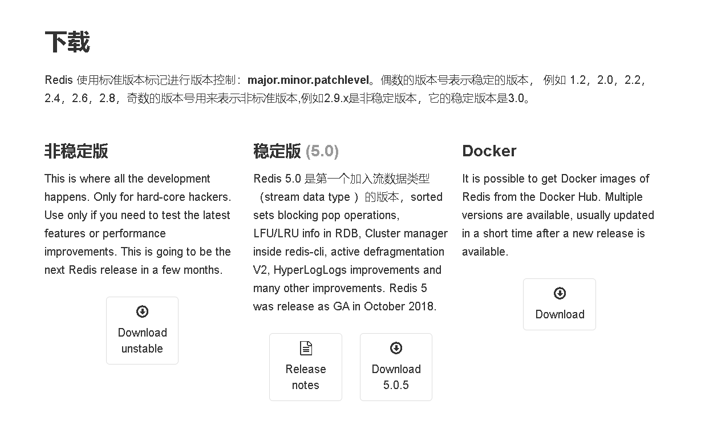
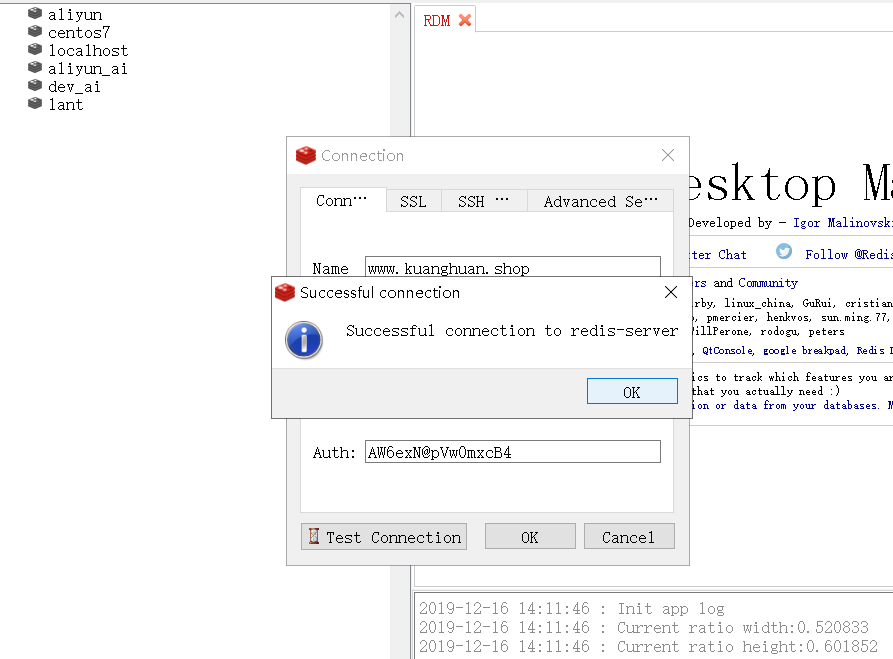

### 修改hostname

1.  修改/etc/hostname文件内容：$ sudo vim /etc/hostname 将里面的内容修改为新的主机名称
2.  修改/etc/hosts文件：$ sudo vim /etc/hosts 将127.0.0.1这一行的内容修改为新的主机名称
3.  重启

### 安装 nginx-1.17.0.tar.gz

1. nginx 的 http 模块使用 pcre 来解析正则表达式，所以需要在 linux 上安装 pcre 库，pcre-devel 是使用 pcre 开发的一个二次开发库
    ```
    yum install -y pcre pcre-devel
    ```

2. zlib 库提供了很多种压缩和解压缩的方式， nginx 使用 zlib 对 http 包的内容进行 gzip ，所以需要在 Centos 上安装 zlib 库
    ```
    yum install -y zlib zlib-devel
    ```

3.  如果有需要，根据error提示可能还需要GCC和OpenSSL
    ```
    yum install gcc-c++
    yum install -y openssl openssl-devel
    ```

4.  开始安装nginx,1.17.0这个是目前最新版本
    ```
    wget -c https://nginx.org/download/nginx-1.17.0.tar.gz
    ```

5.  解压并进入nginx目录
    ```
    tar -zxvf nginx-1.17.0.tar.gz
    cd nginx-1.17.0
    ```
  
6.  使用nginx的默认配置
    ```
    ./configure
    ```

7.  查找安装路径
    ```
    whereis nginx
    ```

8.  安装好后，把nginx添加到系统服务中
    ```
    # 添加nginx.service
    # vim /lib/systemd/system/nginx.service
    [Unit]
    Description=nginx service
    After=network.target 
    [Service] 
    Type=forking
    # 路径对应安装路径
    ExecStart=/usr/local/nginx/sbin/nginx
    ExecReload=/usr/local/nginx/sbin/nginx -s reload
    ExecStop=/usr/local/nginx/sbin/nginx -s quit
    PrivateTmp=true 
    [Install] 
    WantedBy=multi-user.target
    ```

9.  添加完成之后即可
    ```
    systemctl enable|status|start|restart|stop nginx.service
    ```
10. Nginx部署前后端分离服务以及配置
    * 在前后端分离端项目里，前端的代码会被打包成为纯静态文件。使用 Nginx的目的就是让静态文件运行起服务，由于后端的接口也是分离的，直接请求可能会产生跨域问题，此时就需要Nginx转发代理后端接口。
    ````
    user  root; #指定 Nginx Worker 进程运行用户以及用户组
    worker_processes  auto; #启动进程
    
    error_log /var/log/nginx/error.log; #全局错误日志
    #error_log  logs/error.log  notice;
    #error_log  logs/error.log  info;
    pid /run/nginx.pid; #PID文件
    
    
    events {
        worker_connections  1024; #单个后台worker process进程的最大并发链接数
    }
    
    
    http {
        include       mime.types;
        default_type  application/octet-stream;
        gzip on; #开启gzip压缩
        gzip_min_length 1k; #设置对数据启用压缩的最少字节数
        gzip_buffers    4 16k;
        gzip_http_version 1.0;
        gzip_comp_level 6; #设置数据的压缩等级,等级为1-9，压缩比从小到大
        gzip_types text/plain text/css text/javascript application/json application/javascript application/x-javascript application/xml; #设置需要压缩的数据格式
        gzip_vary on;
    
        server {
            listen       80;    #侦听80端口,并为默认服务,default_server只能有一个
            server_name  www.kuanghuan.shop;    #服务域名,可以有多个,用空格隔开
            root /khgo/volume/project/front;    ##定义服务器的默认网站根目录位置
            error_page  404              /404.html; #将404错误页面重定向到index.html可以解决history模式访问不到页面问题
            location / {
                root   html;
                index  index.html index.htm;
            }
    
            location /storemanager/ {
                try_files $uri $uri/ /storemanager/index.html;
            }
    
    
            location /learn/ {
            set $cors '';
            if ($http_origin ~* 'https?://(localhost(:8090)?|www\.kuanghuan\.shop|kuanghuan\.shop)') {
             set $cors 'true';
             }
    
            if ($cors = 'true') {
            add_header 'Access-Control-Allow-Origin' "$http_origin" always;
            add_header 'Access-Control-Allow-Credentials' 'true' always;
            add_header 'Access-Control-Allow-Methods' 'GET, POST, PUT, DELETE, OPTIONS' always;
            add_header 'Access-Control-Allow-Headers' 'Accept,Authorization,Cache-Control,Content-Type,DNT,If-Modified-Since,Keep-Alive,Origin,User-Agent,X-Mx-ReqToken,X-Requested-With' always;
            }
    
            if ($request_method = 'OPTIONS') {
            return 204;
            }
    
            proxy_set_header X-Forwarded-Host $host;
            proxy_set_header X-Forwarded-Server $host;
            proxy_set_header X-Forwarded-For $proxy_add_x_forwarded_for;
            proxy_pass http://127.0.0.1:8080/learn/;
            }
    
             # 图片缓存时间设置
            location ~.*.(gif|jpg|jpeg|png|bmp|swf)$ {
                expires 10d;
            }
            # JS和CSS缓存时间设置
            location ~.*.(js|css)?$ {
                expires 1h;
            }
    
            # redirect server error pages to the static page /50x.html
            #
            error_page   500 502 503 504  /50x.html;
            location = /50x.html {
                root   html;
            }
        } 
    }

    ````
    *  将前端代码打包后的dist文件放入指定服务目录/khgo/volume/project/front/storemanager
    *  将服务目录指定到/khgo/volume/project/front目录下即可代理静态服务
    *  配置里开启了gzip压缩，可以很大程度上减小文件体积大小
    *  将404错误页面重定向到index.html，可以解决前端history路由模式由于刷新页面访问不到服务出现404的问题
    *  location为代理接口，可以转发代理后端的请求接口域名或者ip，即可解决接口跨域问题
    
### firewalld 防火墙配置

1.  不改变状态下重载防火墙
    ```
    firewall-cmd --reload
    ```

2.  基本使用
    ```
    启动： systemctl start firewalld
    关闭： systemctl stop firewalld
    查看状态： systemctl status firewalld 
    开机禁用  ： systemctl disable firewalld
    开机启用  ： systemctl enable firewalld
    ```

3.  systemctl是CentOS7的服务管理工具中主要的工具，它融合之前service和chkconfig的功能于一体
    ```
    启动一个服务：systemctl start firewalld.service
    关闭一个服务：systemctl stop firewalld.service
    重启一个服务：systemctl restart firewalld.service
    显示一个服务的状态：systemctl status firewalld.service
    在开机时启用一个服务：systemctl enable firewalld.service
    在开机时禁用一个服务：systemctl disable firewalld.service
    查看服务是否开机启动：systemctl is-enabled firewalld.service
    查看已启动的服务列表：systemctl list-unit-files|grep enabled
    查看启动失败的服务列表：systemctl --failed
    ```

4.  配置firewalld-cmd
    ```
    查看版本： firewall-cmd --version
    查看帮助： firewall-cmd --help
    显示状态： firewall-cmd --state
    查看所有打开的端口： firewall-cmd --zone=public --list-ports
    更新防火墙规则： firewall-cmd --reload
    查看区域信息:  firewall-cmd --get-active-zones
    查看指定接口所属区域： firewall-cmd --get-zone-of-interface=eth0
    拒绝所有包：firewall-cmd --panic-on
    取消拒绝状态： firewall-cmd --panic-off
    查看是否拒绝： firewall-cmd --query-panic
    ```

5.  开启一个端口
    ```
    添加
    firewall-cmd --zone=public --add-port=80/tcp --permanent    （--permanent永久生效，没有此参数重启后失效）
    重新载入
    firewall-cmd --reload
    查看
    firewall-cmd --zone=public --query-port=80/tcp
    删除
    firewall-cmd --zone=public --remove-port=80/tcp --permanent
    ```

### CentOs7.4安装Mysql8.0.17,[参考文献](https://www.cnblogs.com/yangk1996/p/10700537.html)

1.  [mysql-8.0.18-1.el7.x86_64.rpm-bundle.tar](https://dev.mysql.com/downloads/mysql/)
2.  卸载Linux自带mariadb[什么是mariadb?](http://www.sohu.com/a/252174706_355140)
    ````
    查看是否存在
    rpm -qa | grep mariadb
    卸载
    rpm -e mariadb-libs-5.5.56-2.el7.x86_64 --nodeps
    在查看是否存在
    rpm -qa | grep mariadb
    ````
3.  通过FTP将下载好的mysql-8.0.18-1.el7.x86_64.rpm-bundle.tar传输到/khgo/volume/service
4.  解压MySQL
    ````
    tar -xvf mysql-8.0.17-1.el7.x86_64.rpm-bundle.tar
    ````
5.  依此安装所需RPM
    ````
    rpm -ivh mysql-community-common-8.0.17-1.el7.x86_64.rpm  --nodeps --force
    rpm -ivh mysql-community-libs-8.0.17-1.el7.x86_64.rpm  --nodeps --force
    rpm -ivh mysql-community-client-8.0.17-1.el7.x86_64.rpm --nodeps --force
    rpm -ivh mysql-community-server-8.0.17-1.el7.x86_64.rpm --nodeps --force
    查看依赖
    rpm -qa | grep mysql
    ````
    
6.  依此执行执行初始化命令
    ````
    $ mysqld --initialize
    报错：mysqld: error while loading shared libraries: libaio.so.1: cannot open shared object file: No such file or directory
    解决：yum install -y libaio
    $ chown mysql:mysql /var/lib/mysql -R
    $ systemctl start mysqld.service
    报错：Job for mysqld.service failed because the control process exited with error code. See "systemctl status mysqld.service" and "journalctl -xe" for details.
    解决：rm -rf /var/lib/mysql
    $ systemctl  enable mysqld
    查看初始Mysql密码
    $ cat /var/log/mysqld.log | grep password
    结果：2019-12-03T05:54:50.131567Z 5 [Note] [MY-010454] [Server] A temporary password is generated for root@localhost: 0wVr<#prLEow
    使用命令登录MySQL
    mysql -uroot -p
    password: 0wVr<#prLEow
    ````
    
7.  修改MySQL密码，并远程授权
    
    ````
    ALTER USER 'root'@'localhost' IDENTIFIED WITH mysql_native_password BY 'khgo2019';
    失败：ERROR 1819 (HY000): Your password does not satisfy the current policy requirements
    原因：密码强度太低
    为了安全我们就不修改mysql默认安全策略了(大小写，特殊字符都加上)
    ALTER USER 'root'@'localhost' IDENTIFIED WITH mysql_native_password BY 'khGo_2019';
    成功！
    远程访问Mysql,通过下面命令授权
    create user 'root'@'%' identified with mysql_native_password by 'mypassword';
    grant all privileges on *.* to 'root'@'%' with grant option;
    flush privileges;
    exit;
    最后使用navicat看是否能连接数据库！
    ````
    
    
### CentOs7.4安装 redis-5.0.5

1.  下载最稳定个版本[redis-5.0.5.tar.gz](http://www.redis.cn/download.html)
    

    `````
    $ wget http://download.redis.io/releases/redis-5.0.5.tar.gz
    $ tar tar xzf redis-5.0.5.tar.gz
    $ cd redis-5.0.5
    $ make
    `````

2.  make命令结束后，redis-5.0.5目录里面会出现编译后的redis服务程序redis-server,以及测试的客户端程序redis-cli,两个程序都位于src目录下
    
    ````
    # 默认启动
    $ cd src
    $ ./redis-server &
    # 携带配置启动
    $ ./redis-server ../redis.conf
    ````

3.  启动服务进程后，可以使用测试客户端redis-cli和redis服务交互

    ```
    $ ./redis-cli
    redis> set foo bar
    OK
    redis> get foo
    "bar"
    redis> exit
    ```

4.  设置redis为系统服务

    ````
    #/lib/systemd/system/redis.service
    [Unit]
    Description=Redis Server
    After=network.target
    
    [Service]
    Type=forking
    PIDFile=/var/run/redis_6379.pid
    ExecStart=/khgo/volume/service/redis-5.0.5/src/redis-server /khgo/volume/service/redis-5.0.5/redis.conf
    ExecReload=/bin/kill -s HUP $MAINPID
    ExecStop=/bin/kill -s QUIT $MAINPID
    PrivateTmp=true
    
    [Install]
    WantedBy=mutli-user.target
    ````

5.  重新载入服务

    ```
    #重新载入 systemctl 并启动服务
    systemctl daemon-reload
    systemctl start redis.service
    #查看状态
    systemctl status redis.service
    #关闭
    systemctl stop redis.service
    #开机自启
    systemctl enable redis.service
    #是否开机自启
    systemctl is-enabled redis.service
    ```
    成功！
    

6.  redis配置

    ````
    # 绑定的主机地址
    #bind 127.0.0.1
    # 指定Redis监听端口，默认端口为6379,为什么选用6379作为默认端口,因为6379在手机按键上MERZ对应的号码，而MERZ取自意大利歌女Alessia Merz的名字
    port 6379
    # redis3.2版本后新增protected-mode配置，默认是yes，即开启。设置外部网络连接redis服务
    protected-mode no
    # 当客户端闲置多长时间后关闭连接，如果指定为0，表示关闭该功能
    timeout 300
    # Redis默认不是以守护进程的方式运行，可以通过该配置项修改，使用yes启用守护进程
    daemonize yes
    # 当运行多个 redis 服务时，需要指定不同的 pid 文件和端口
    pidfile /var/run/redis_6379.pid
    # 指定日志记录级别，Redis总共支持四个级别：debug、verbose、notice、warning，默认为verbose
    loglevel notice
    # 设置数据库的数量，默认数据库为0，可以使用SELECT <dbid>命令在连接上指定数据库id
    databases 16
    # 设置Redis连接密码，如果配置了连接密码，客户端在连接Redis时需要通过AUTH <password>命令提供密码，默认关闭
    requirepass AW6exN@pVw0mxcB4
    # 设置同一时间最大客户端连接数，默认无限制，Redis可以同时打开的客户端连接数为Redis进程可以打开的最大文件描述符数，
    # 如果设置 maxclients 0，表示不作限制。当客户端连接数到达限制时，Redis会关闭新的连接并向客户端
    # 返回max number of clients reached错误信息
    maxclients 128
    # 指定Redis最大内存限制，Redis在启动时会把数据加载到内存中，达到最大内存后，Redis会先尝试清除已到期或即将到期的Key，
    # 当此方法处理 后，仍然到达最大内存设置，将无法再进行写入操作，但仍然可以进行读取操作。Redis新的vm机制，会把Key存放内存，
    # Value会存放在swap区
    # 一般推荐Redis设置内存为最大物理内存的四分之三
    maxmemory 751619276
    # 指定是否在每次更新操作后进行日志记录，Redis在默认情况下是异步的把数据写入磁盘，如果不开启，可能会在断电时导致一段时间内的数据丢失。
    # 因为 redis本身同步数据文件是按上面save条件来同步的，所以有的数据会在一段时间内只存在于内存中。默认为no
    appendonly no
    ````

    
    


