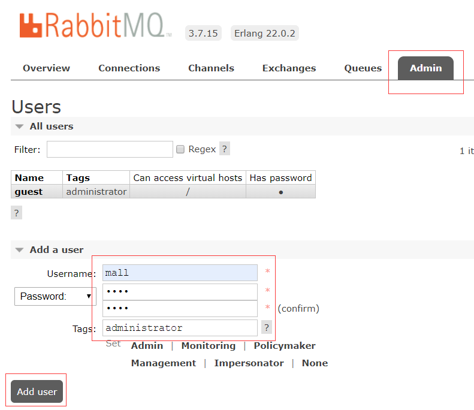
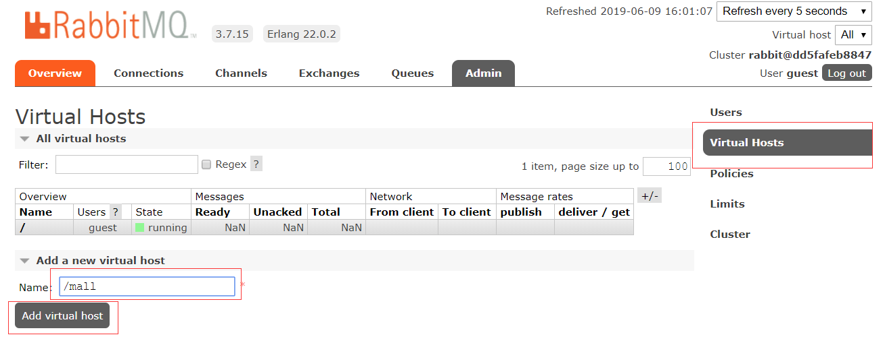
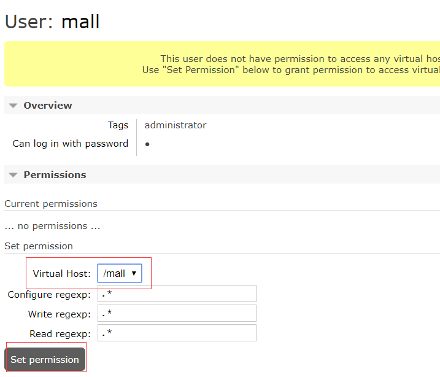

## Docker环境安装

*   安装yum-utils:
````
yum install -y yum-utils device-mapper-persistent-data lvm2
````

*   为yum源添加docker仓库位置：
````
yum-config-manager --add-repo https://download.docker.com/linux/centos/docker-ce.repo
````

*   安装docker：
````
yum install docker-ce
````

*   启动docker：
````
systemctl start docker
````

## Mysql安装

*   下载mysql5.7的docker镜像：
````
docker pull mysql:5.7
````

*   使用docker命令启动：
````
docker run -p 3306:3306 --name mysql \
-v /mydata/mysql/log:/var/log/mysql \
-v /mydata/mysql/data:/var/lib/mysql \
-v /mydata/mysql/conf:/etc/mysql \
-e MYSQL_ROOT_PASSWORD=root  \
-d mysql:5.7
````

*   参数说明
    *   -p 3306:3306：将容器的3306端口映射到主机的3306端口
    *   -v /mydata/mysql/conf:/etc/mysql：将配置文件夹挂在到主机
    *   -v /mydata/mysql/log:/var/log/mysql：将日志文件夹挂载到主机
    *   -v /mydata/mysql/data:/var/lib/mysql/：将数据文件夹挂载到主机
    *   -e MYSQL_ROOT_PASSWORD=root：初始化root用户的密码

*   进入运行mysql的docker容器：
```text
docker exec -it mysql /bin/bash
```

*   使用mysql命令打开客户端：
```text
mysql -uroot -proot --default-character-set=utf8
```

*   创建mall数据库：
```text
create database mall character set utf8
```

*   安装上传下载插件，并将docment/sql/mall.sql上传到Linux服务器上：
```text
yum -y install lrzsz
```

*   将mall.sql文件拷贝到mysql容器的/目录下：
```text
docker cp /mydata/mall.sql mysql:/
```

*   将sql文件导入到数据库：
```text
use mall;
source /mall.sql;
```

*   创建一个reader帐号并修改权限，使得任何ip都能访问：
```text
grant all privileges on *.* to 'reader' @'%' identified by '123456';
```

## Redis安装

*   下载redis3.2的docker镜像：
```text
docker pull redis:3.2
```

* 使用docker命令启动：
```text
docker run -p 6379:6379 --name redis \
-v /mydata/redis/data:/data \
-d redis:3.2 redis-server --appendonly yes
```

*   进入redis容器使用redis-cli命令进行连接：
```text
docker exec -it redis redis-cli
```


## Nginx安装

*   下载nginx1.10的docker镜像：
```text
docker pull nginx:1.10
```

*   从容器中拷贝nginx配置
    *   先运行一次容器（为了拷贝配置文件）：
    ```text
    docker run -p 80:80 --name nginx \
    -v /mydata/nginx/html:/usr/share/nginx/html \
    -v /mydata/nginx/logs:/var/log/nginx  \
    -d nginx:1.10
    ```
    *   将容器内的配置文件拷贝到指定目录：
    ```text
    docker container cp nginx:/etc/nginx /mydata/nginx/
    ```
    *   修改文件名称：
    ```text
    mv nginx conf
    ```
    
    
    
    *   终止并删除容器：
    ```text
    docker stop nginx
    docker rm nginx
    ```
*   使用docker命令启动：
```text
docker run -p 80:80 --name nginx \
-v /mydata/nginx/html:/usr/share/nginx/html \
-v /mydata/nginx/logs:/var/log/nginx  \
-v /mydata/nginx/conf:/etc/nginx \
-d nginx:1.10
``` 

## RabbitMQ安装

*   下载rabbitmq3.7.15的docker镜像：
```text
docker pull rabbitmq:3.7.15
```

*   使用docker命令启动：
```text
docker run -d --name rabbitmq \
--publish 5671:5671 --publish 5672:5672 --publish 4369:4369 \
--publish 25672:25672 --publish 15671:15671 --publish 15672:15672 \
rabbitmq:3.7.15
```

*   进入容器并开启管理功能：
```text
docker exec -it rabbitmq /bin/bash
rabbitmq-plugins enable rabbitmq_management
```


*   开启防火墙：
```text
firewall-cmd --zone=public --add-port=15672/tcp --permanent
firewall-cmd --reload
```

*   访问地址查看是否安装成功：http://106.14.146.164:15672/ 
*   输入账号密码并登录：guest guest
*   创建帐号并设置其角色为管理员：mall mall
  

*   创建一个新的虚拟host为：/mall


*   点击mall用户进入用户配置页面
  

*   给mall用户配置该虚拟host的权限
 


## Elasticsearch安装

*   下载elasticsearch6.4.0的docker镜像：
```text
docker pull elasticsearch:6.4.0
```

*   修改虚拟内存区域大小，否则会因为过小而无法启动:
```text
sysctl -w vm.max_map_count=262144
```

*   使用docker命令启动：
```text
docker run -p 9200:9200 -p 9300:9300 --name elasticsearch \
-e "ES_JAVA_OPTS=-Xms256m -Xmx256m" \
-e "discovery.type=single-node" \
-e "cluster.name=elasticsearch" \
-v /mydata/elasticsearch/plugins:/usr/share/elasticsearch/plugins \
-v /mydata/elasticsearch/data:/usr/share/elasticsearch/data \
-d elasticsearch:6.4.0

```

*   启动时会发现/usr/share/elasticsearch/data目录没有访问权限，只需要修改/mydata/elasticsearch/data目录的权限，再重新启动。
```text
chmod 777 /mydata/elasticsearch/data/
```

*   安装中文分词器IKAnalyzer，并重新启动：
```text
docker exec -it elasticsearch /bin/bash
#此命令需要在容器中运行
elasticsearch-plugin install https://github.com/medcl/elasticsearch-analysis-ik/releases/download/v6.4.0/elasticsearch-analysis-ik-6.4.0.zip
docker restart elasticsearch
```

*   开启防火墙：
```text
firewall-cmd --zone=public --add-port=9200/tcp --permanent
firewall-cmd --reload
```

*   访问http://106.14.146.164:9200/


## kibana安装

*   下载kibana6.4.0的docker镜像：
```text
docker pull kibana:6.4.0
```

*   使用docker命令启动：
```text
docker run --name kibana -p 5601:5601 \
--link elasticsearch:es \
-e "elasticsearch.hosts=http://106.14.146.164:9200" \
-d kibana:6.4.0
```

*   开启防火墙：
```text
firewall-cmd --zone=public --add-port=5601/tcp --permanent
firewall-cmd --reload
```

*   访问http://106.14.146.164:5601/


## Mongodb安装

*   下载mongo3.2的docker镜像：
```text
docker pull mongo:3.2
```

*   使用docker命令启动：
```text
docker run -p 27017:27017 --name mongo \
-v /mydata/mongo/db:/data/db \
-d mongo:3.2
```

## 至此docker全部环境安装完成


## 使用docker-maven-plugin插件构建docker镜像

*   Dockerfile方式构建
    1. 配置本机DOCKER_HOST环境变量
    
    2.  pom配置
    ```text
    <build>
            <plugins>
                <plugin>
                    <groupId>org.springframework.boot</groupId>
                    <artifactId>spring-boot-maven-plugin</artifactId>
                </plugin>
                <plugin>
                    <groupId>com.spotify</groupId>
                    <artifactId>docker-maven-plugin</artifactId>
                    <version>${docker.maven.plugin.version}</version>
                    <executions>
                        <execution>
                            <id>build-image</id>
                            <phase>package</phase>
                            <goals>
                                <goal>build</goal>
                            </goals>
                        </execution>
                    </executions>
                    <configuration>
                        <imageName>superm/${project.artifactId}:${project.version}</imageName>
                        <dockerHost>${docker.host}</dockerHost>
                        <dockerDirectory>${project.basedir}/src/main/docker</dockerDirectory>
                        <resources>
                            <resource>
                                <targetPath>/</targetPath>
                                <directory>${project.build.directory}</directory>
                                <include>${project.build.finalName}.jar</include>
                            </resource>
                        </resources>
                    </configuration>
                </plugin>
            </plugins>
        </build>
    ```
    3.Dockerfile配置
    ```dockerfile
    # 该镜像需要依赖的基础镜像
    FROM java:8
    # 将当前目录下的jar包复制到docker容器的/目录下
    ADD superm-admin-1.0-SNAPSHOT.jar /superm-admin.jar
    # 运行过程中创建一个superm-admin.jar文件
    RUN bash -c 'touch /superm-admin.jar'
    # 声明服务运行在8080端口
    EXPOSE 8080
    # 指定docker容器启动时运行jar包
    ENTRYPOINT ["java", "-jar","/superm-admin.jar"]
    # 指定维护者的名字
    MAINTAINER xudongye
    ```
    4.运行mvn打包指令
    
    5.查看docker镜像
    
    5.运行
    ```text
    docker run -p 8080:8080 \
    --name superm-admin \
    --link mysql:106.14.146.164 \
    --link redis:106.14.146.164 \
    -v /etc/localtime:/etc/localtime \
    -v /mydata/app/admin/logs:/var/logs \
    -d superm/superm-admin:1.0-SNAPSHOT
    ```